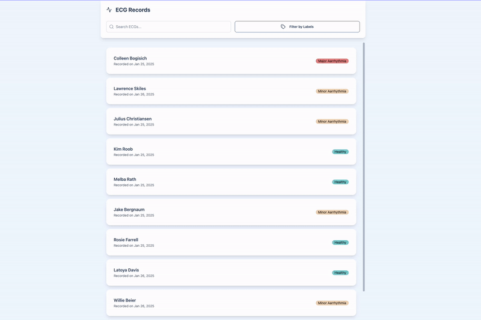

# ECG Records

A very simple Angular 19 App built without Observables using signals and [TansStack query](https://tanstack.com/query/latest/docs/framework/angular/overview).

This app also uses :

- DOM unit testing: [DOM Testing Library](https://testing-library.com/docs/dom-testing-library/intro)
- UI: [TailwindCSS v3](https://v3.tailwindcss.com/) & [DaisyUI](https://daisyui.com/)
- Icons: [Lucide Angular](https://lucide.dev/)
- State Management: [NgRx Signal Store](https://ngrx.io/guide/signals/signal-store) (only for demo purpose on this branch)

## Quick Demo



## Development

Start a local development server:

```bash
npm start
```

Run eslint or prettier:

```bash
npm run lint
npm run lint:fix
npm run prettier
```

Once the server is running, open your browser and navigate to `http://localhost:4200/`.

## Building

To build the project run:

```bash
npm run build
```

This will compile your project and store the build artifacts in the `dist/` directory.

## Unit tests

Execute unit tets with Karma in ChromeHeadless:

```bash
npm run test:watch
```

Execute unit tests with Karma in the Chrome browser:

```bash
npm run test
```
